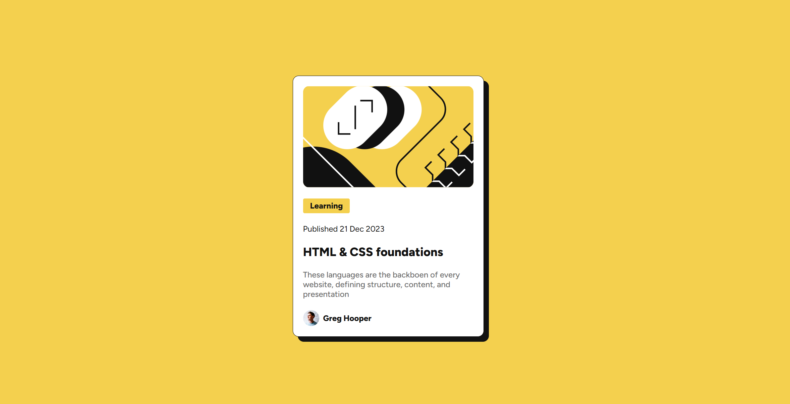

# Frontend Mentor - Blog preview card solution

This is a solution to the [Blog preview card challenge on Frontend Mentor](https://www.frontendmentor.io/challenges/blog-preview-card-ckPaj01IcS). Frontend Mentor challenges help you improve your coding skills by building realistic projects. 

## Table of contents

- [Overview](#overview)
  - [The challenge](#the-challenge)
  - [Screenshot](#screenshot)
  - [Links](#links)
- [My process](#my-process)
  - [Built with](#built-with)
- [Author](#author)

## Overview

### The challenge

Users should be able to:

- See hover and focus states for all interactive elements on the page

### Screenshot

### Links

- Solution URL: [Solution](https://github.com/EngSeif/Frontend_Mentor_Challenges/tree/main/blogPreview_Card)
- Live Site URL: [Live URL](https://frontend-mentor-challenges-oo6u.vercel.app/)

## My process

### Built with

- Semantic HTML5 markup
- CSS custom properties
- Flexbox
- Mobile-first workflow

## Author

- Website - [engseif](https://github.com/EngSeif)
- Frontend Mentor - [@engseif](https://www.frontendmentor.io/profile/engseif)
- Linkedin - [Seif Mohamed](https://www.linkedin.com/in/seif-mohamed-bb7b33252/)
